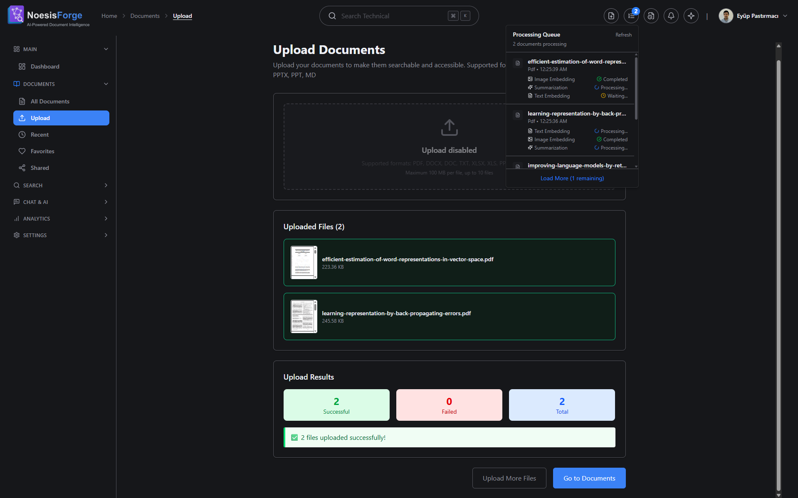
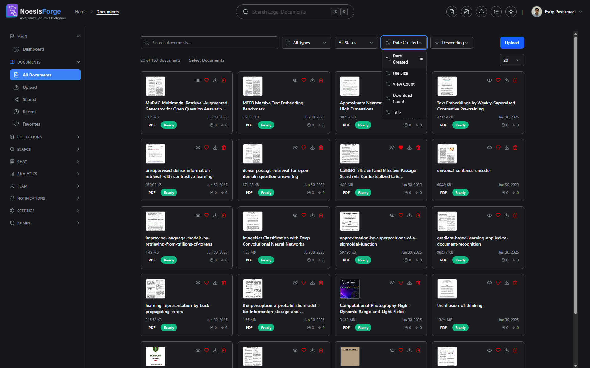
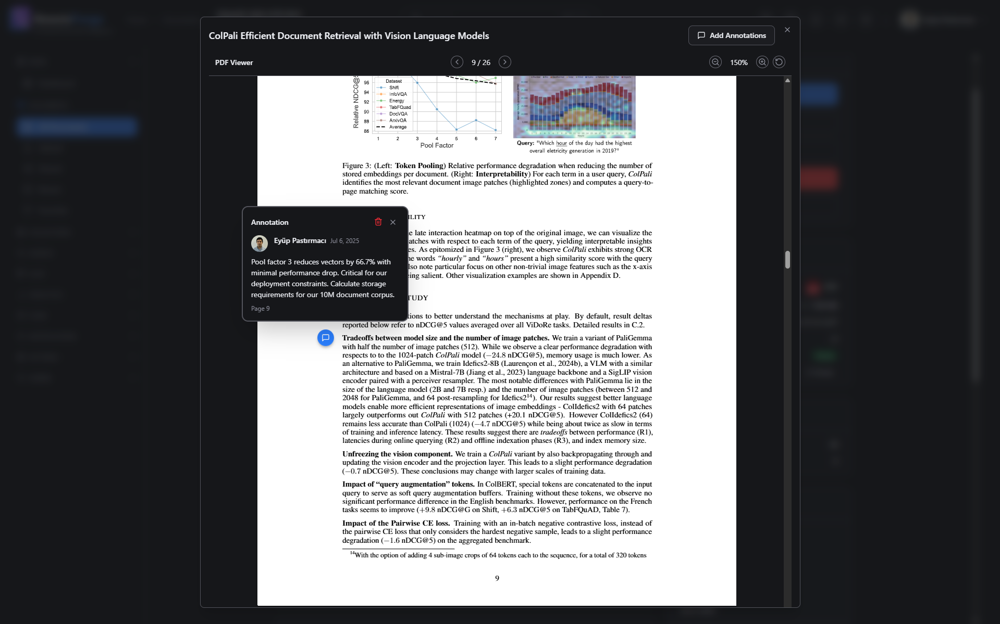
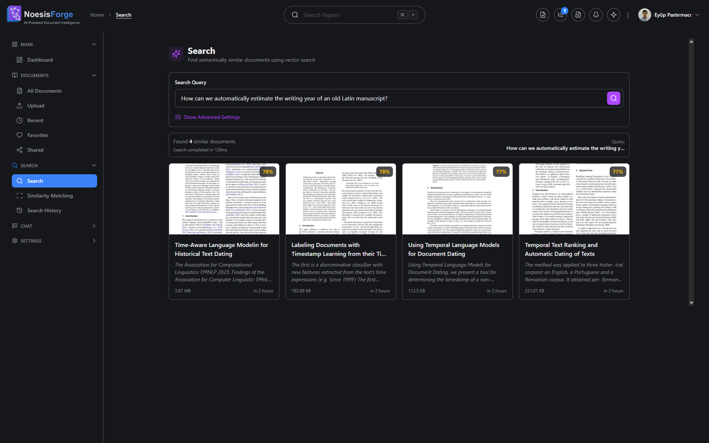
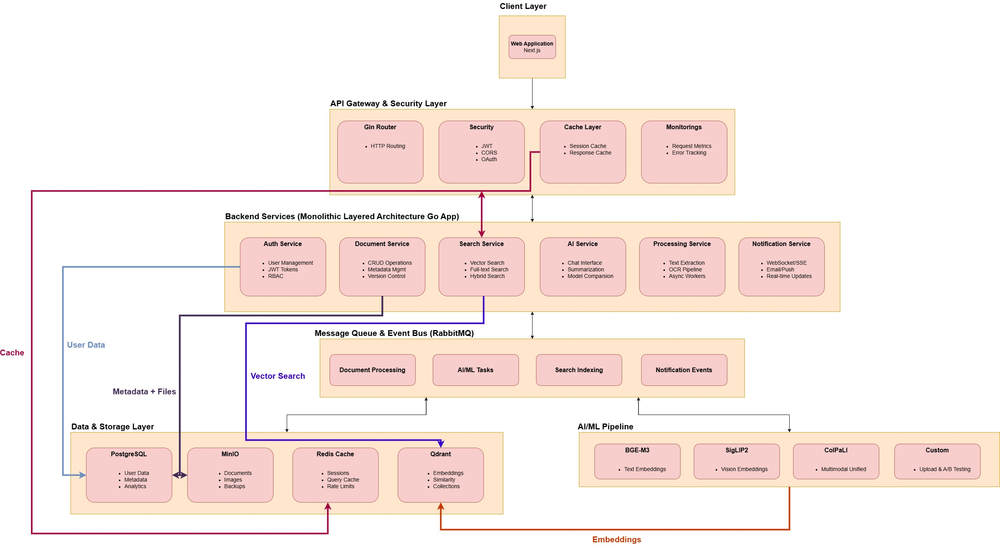

## 🌟 Overview

**NoesisForge** is a local RAG platform that transforms how you interact with documents. Search intelligently, match similar documents, auto-categorize your files, generate summaries, and chat with your content all through a self-hosted solution that ensures complete privacy and control over your data.

## 📸 Screenshots









## 🚧 Development Status

**This is a learning-oriented project currently under active development. Not recommended for production use.**

## ✨ Key Features

- **Document Management**: Multi-format support (PDF, DOCX, TXT), intelligent processing, version control
- **Search**: Full-text search with PostgreSQL, basic semantic search foundation
- **Document Processing**: Text extraction, embedding generation, automatic summarization
- **RAG & Conversational AI**: Chat with your documents, intelligent retrieval with context, source citations, document similarity matching
- **Security**: Self-hosted, local processing, JWT authentication

## 🎯 Perfect For

- **Research Institutions**: Academic paper management, document organization and basic search
- **Enterprise Teams**: Self-hosted document management with privacy-compliant deployment

## 🗺️ Development Roadmap

### Phase 1: Core Infrastructure & Basic Features

**Create Account, Login, Authentication**
- ✅ User registration system
- ✅ Login functionality
- ✅ JWT authentication
- ✅ Password hashing and security
- ✅ Protected routes middleware
- ✅ End-to-end encryption (User profile fields email, phone...)

**Sidebar & Layout System**
- ✅ `AuthenticatedLayout` component
- ✅ `PublicLayout` component
- ✅ `Sidebar` component (responsive)
- ✅ Navigation state management

**Dashboard**
- ✅ Basic dashboard layout
- ✅ Stats cards (mock data initially)
- ✅ Recent documents widget
- ✅ Quick actions section

**Profile & Settings**
- ✅ Profile update form
- ✅ Avatar upload
- ✅ Password change
- ✅ Theme preferences (light/dark)

### Phase 2: Document Management Core

**Document Upload**
- ✅ File upload component (drag & drop)
- ✅ MinIO integration
- ✅ Upload progress tracking
- ✅ Basic metadata form
- ✅ Backend: Document service, MinIO setup
- ✅ Batch processing (Handle multiple documents simultaneously)
- ✅ Version control (Track document changes and revisions)

**Documents List**
- ✅ Document grid view
- ✅ Basic filtering & sorting
- ✅ Pagination
- ✅ Document actions (download, delete, preview)
- ✅ Backend: Document CRUD APIs

**Document Viewer**
- ✅ PDF viewer integration
- ✅ Document metadata display
- ✅ Download functionality
- ✅ Basic sharing (generate link)

**Document Detail & Management**
- ✅ Document detail page with full metadata
- ✅ Document favoriting system
- ✅ Favorites page (My Favorite Documents)
- ✅ Shared documents page (Documents Shared with Me)
- ✅ Document comments and annotations
- ✅ Document activity history

### Phase 3: Search Foundation

**Basic Search**
- ✅ Search input component
- ✅ Search results page
- ✅ PostgreSQL full-text search
- ✅ Backend: Search service basics

**Document Processing Pipeline**
- ✅ RabbitMQ setup
- ✅ Embedding worker (BGE-M3)
- ✅ Multimodal embeddings (SigLIP2)
- ✅ Text extraction service
- ✅ Qdrant vector storage setup
- ✅ Automatic document summarization
- ☐ GPU support for models
- ☐ Built-in models management

### Phase 4: Advanced Search & Document Intelligence

**Search & Similarity**
- ✅ Vector similarity search (semantic search)
- ☐ Similarity Matching (document comparison)
- ☐ Hybrid search (content, summary, fts, vector)
- ☐ Search filters
- ☐ Search history tracking

**Intelligent Document Classification**
- ☐ Document type classifier model integration
- ☐ Automatic categorization
- ☐ Category based filtering in document list
- ☐ Manual category override functionality

**Advanced Layout Understanding**
- ☐ Form field extraction and validation
- ☐ Table and invoice processing
- ☐ Key‑value pair extraction
- ☐ Structured data export

**Category‑based Search & Analytics**
- ☐ Document type filters in search
- ☐ Semantic search within specific categories
- ☐ Document similarity matching by category

### Phase 5: Conversational RAG & Chat Experience

**Chat UI (Frontend)**
- ☐ Streaming responses with markdown + code highlighting
- ☐ Source citation chips linking to document pages
- ☐ Follow‑up quick‑reply suggestions
- ☐ Per chat conversation history, rename feature

**Backend Chat Service**
- ☐ Ollama LLM gateway
- ☐ RAG pipeline orchestrator
- ☐ Context window management 
- ☐ Per user conversation memory

**Advanced RAG Features**
- ☐ "Ask‑about‑this‑page/selection" context injection
- ☐ Citations with bounding‑box coordinates for PDF viewer highlights
- ☐ Dynamic tool selection (summarize, translate, extract table) via function calls
- ☐ Caching layer for identical queries
- ☐ Safety / guardrail prompts & profanity filtering

### Phase 6: CI/CD & DevOps

- ☐ Jenkins pipeline setup
- ☐ Automated testing (unit, integration)
- ☐ Automated building (Docker images)
- ☐ Automated deployment (staging/production)
- ☐ Code quality checks (linting, security scans)
- ☐ Environment-specific configurations
- ☐ Rollback strategies

## 🛠️ Tech Stack

- **Backend**: Go 1.24.2 + Gin, PostgreSQL, Redis, MinIO, JWT authentication
- **Frontend**: Next.js 15 + React 19, Tailwind CSS, TypeScript, Redux Toolkit
- **AI/ML**: BGE-M3, SigLIP2, Ollama (local LLM), Qdrant vector database
- **Infrastructure**: Docker + Docker Compose, Air (dev), Prometheus + Grafana (monitoring)
- **CI/CD**: Jenkins 2.504.3 (automated testing, building, deployment)

## 🏗️ Architecture



## 🚀 Getting Started

### Prerequisites

- **Docker** & Docker Compose
- **Node.js** For running npm scripts
- **Jenkins** 2.504.3 (for automated tests, builds and deployments - Future/Planned)

### Installation

##### 1. Clone the repository
```bash
git clone https://github.com/eyuppastirmaci/noesis-forge.git
cd noesis-forge
```

##### 2. Start the application

**Docker Build** (for first time running or whenever docker files changes):
```bash
npm run build
```

**Development Mode** (with hot reload):
```bash
npm run dev
```
This starts infrastructure services (database, Redis, MinIO, RabbitMQ, Qdrant) with Docker, and runs backend (Air) and frontend (Next.js dev server) in separate terminals.

**Production Mode**:
```bash
npm run start:stack
```
This starts all services including the built application containers.

**Stop All Services**:
```bash
npm run down
```
This stops and removes all Docker containers.

## 🚀 Access Your Application

- **Frontend**: http://localhost:3000
- **Backend API**: http://localhost:8080
- **MinIO Console**: http://localhost:9001 (minioadmin/minioadmin123)
- **Redis**: http://localhost:6379 or (redis-cli | [RedisInsight](https://redis.io/insight/))
- **Database**: on port 5432 or any SQL client
- **Qdrant**: http://localhost:6333/dashboard#/welcome
- **Jenkins**: http://localhost:8080 (Future/Planned)

## 🚀 Deployment

### Jenkins CI/CD Setup (Future/Planned)

## 📄 License

This project is licensed under the MIT License - see the [LICENSE](LICENSE) file for details.

## 👥 Authors & Contributors

- **Eyup Pastirmaci** - [@eyuppastirmaci](https://github.com/eyuppastirmaci)

## 🙏 Acknowledgments

- **[Beijing Academy of Artificial Intelligence (BAAI)](https://huggingface.co/Xenova/bge-m3)** for BGE-M3 multilingual embedding model
- **[Google Research](https://huggingface.co/Xenova/siglip-base-patch16-224)** for SigLIP2 vision-language model
- **[Ollama](https://ollama.com/)** for making local LLM deployment accessible and efficient
- **[Qdrant](https://qdrant.tech/)** team for the excellent vector database with hybrid retrieval support
- **[Hugging Face](https://huggingface.co/)** for providing a platform for AI model sharing
- **The Go community** for excellent tooling and libraries
- **React and Next.js teams** for frontend frameworks
- **All open-source contributors** who make projects like this possible